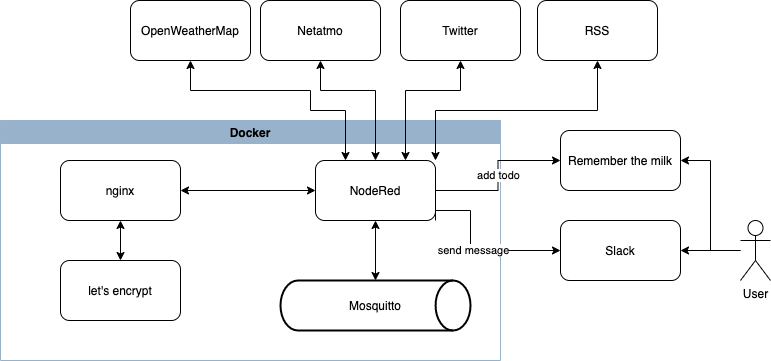
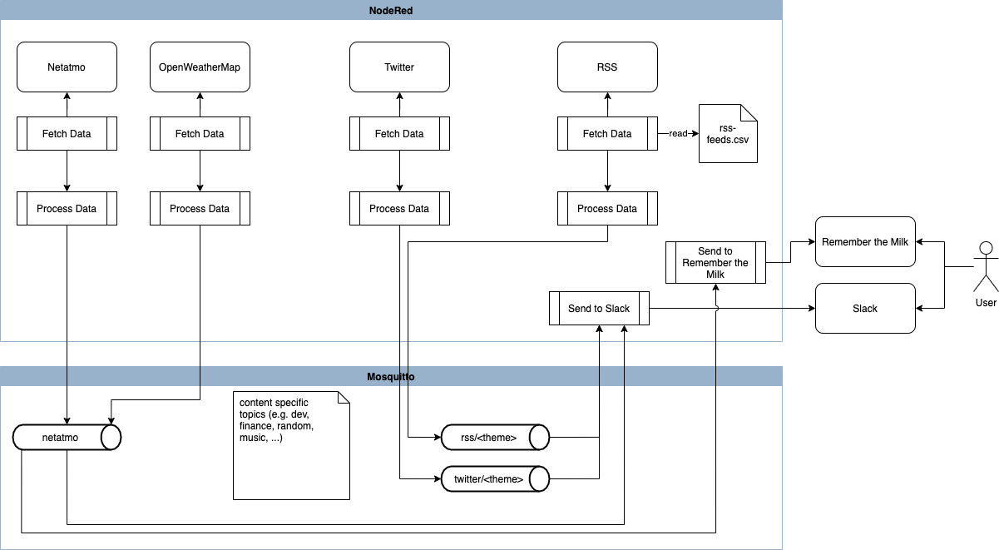

# My Control Tower

## Why?

What's the reason for this project? I have done a lot of automation with IFTTT, fetching RSS feeds, tweets, my Netatmo, ... messages and pushing to Slack oder[ Remember the Milk](http://rememberthemilk.com/).  But with my small smart home solution based on [NodeRed](https://nodered.org), I thought "Why not switching from IFTTT to it as well.
And I'm a nerd, I want to code. :-)

## Architecture





## Setup

### Repository Structure

```
├── README.md
├── img
├── nodered
│   ├── TEMPLATE.env
│   ├── data
│   │   └── feeds.csv
│   ├── docker-compose.yml
│   └── mosquitto
│       └── conf
│           └── mosquitto.conf
└── proxy
    ├── TEMPLATE.env
    ├── config
    │   └── custom_config.conf
    └── docker-compose.yml
```

* proxy: spinning up NGINX with Let's Encrypt as a reverse proxy
* nodered: the actual NodeRed configuration
  * data: the data folder with an example of the feeds.csv file
  * mosquitto: as the messaging is done via [Mosquitto](https://mosquitto.org), this needs to be spinned up as well

### Installation

* create a docker network (in my case __nginx-proxy__)
* create copies of the TEMPLATE.env files, save them as .env and modify the values.
* 